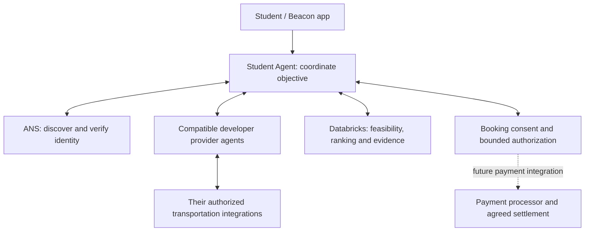

# Beacon provider network — what changes

September 19, 2026. Approved product direction for Mahin, Rishit and Akshar.
This describes the target architecture; it does not claim the new account,
payment or independent commercial provider integrations are implemented.

## The new idea

Beacon owns the student's objective: **get me home within my constraints**.
The Student Agent discovers compatible provider agents, collects their offers,
asks Databricks to recommend a feasible plan, obtains the student's confirmation,
and coordinates that plan through completion or recovery after failure.

Developers can build agents for different transportation services. Those agents
own their permitted booking integrations and return booking status to Beacon.
Uber, Lyft, Amtrak, Greyhound, subway services and airlines are examples of the
future ecosystem, not current Beacon partners or working integrations.

The intended experience is one Beacon profile and a payment method saved through
a payment processor. A separate platform login is unnecessary only where the
provider's approved booking model supports that. Moving code into another agent
does not bypass a platform's permissions or account requirements.

## What changes from the earlier concept

The earlier column describes the previous product idea, not completed OAuth code.

| Area | Earlier concept | New direction |
| --- | --- | --- |
| Onboarding | Connect personal Uber/Lyft accounts upfront | Set up Beacon preferences, destination and permissions; payment is a future processor-backed capability |
| Booking responsibility | Student Agent integrates directly with each ride platform | Student Agent delegates a bounded request to a compatible provider agent |
| Provider integration | Beacon implements every platform connector | Independent developers or operators can implement connectors using their own approved access |
| Discovery | A fixed list of platform integrations | ANS discovery plus a versioned Beacon compatibility contract and provider admission policy |
| Identity | Platform account login is central | ANS verifies agent identity; separate authorization controls what that agent may do |
| Decision | Compare ride options | Databricks compares feasible offers using cost and supported trip-burden evidence |
| Payment | Platform charges the linked platform account | Target: one Beacon payment experience with an explicitly supported settlement arrangement |
| Recovery | Retry a platform integration | Reconcile the old booking, obtain fresh offers and coordinate a replacement within consent and budget |
| Expansion | Add another platform inside Beacon | Add another compatible provider implementation without rewriting the Student Agent |

## How a trip works

1. The student supplies a destination, budget and preferences. Beacon keeps precise
   location private until the selected provider passes identity and authorization checks.
2. Beacon discovers candidate agents through ANS and checks their supported
   operations, service area, protocol version and admission status.
3. Compatible agents receive coarse trip context and return honest offers:
   availability, price basis, expiry, wait, walking, pickup requirements and source.
4. Databricks ranks feasible options. Beacon shows one recommendation with its
   cost, tradeoffs, missing information and simulation/source labels.
5. The student confirms. Beacon rechecks the offer and permissions, then sends
   only the necessary booking data to the chosen agent. A changed price or terms
   outside the approved bounds require fresh confirmation.
6. The provider agent books through its authorized integration. It returns a
   booking reference, pickup/boarding instructions and status.
7. Beacon follows progress. On failure it reconciles any uncertain booking or
   charge before replacing it, and keeps the student informed.

## ANS stays important, but does not replace authorization

ANS answers **which registered agent is this?** Compatibility answers **does it
speak our protocol?** Authorization answers **may it perform this operation for
this student now?** Payment approval answers **who may charge how much?**

These are separate checks. A verified developer operating a connector is not
automatically the transportation company named in its description. Display the
actual operator separately from the service it supports. Registration alone is
not proof of platform affiliation, booking rights, reliability or route safety.
GoDaddy describes ANS identity as complementary to OAuth authorization in its
[ANS verification overview](https://www.godaddy.com/resources/news/dont-trust-verify-offline-sub-millisecond-agent-verification-with-ans).

This is still built with APIs. The architectural difference is the common,
discoverable service contract and the Student Agent's ongoing responsibility
for the objective across independently operated services. A provider does not
need an LLM merely to quote, book and report status.

## Payment and platform access are real work

Do not pass raw card details, platform credentials or a reusable wallet secret
to arbitrary agents. The target is a processor-backed payment arrangement with
an authorization bound to a provider, offer, operation, amount, currency and
expiry. The team must define who charges the student, who pays the transport
platform, and who handles cancellations, refunds and disputes.

A payment token saved by Beacon is not a universal payment method that every
developer can redeem. No such interoperability is implemented here. The first
demo must use clearly labeled simulated payment and transport, with no real
card collection or charges.

Platform requirements differ. Uber's published rider API uses user scopes and
requires approval for production use of privileged booking scopes
([Uber scopes](https://developer.uber.com/docs/riders/guides/scopes)). Lyft's
Concierge model supports organization-arranged rides without rider signup, but
the booking organization handles payment
([Concierge API](https://help.lyft.com/business/hc/en-us/articles/360001599667-Concierge-API-overview),
[rider payment FAQ](https://help.lyft.com/business/hc/en-us/articles/1255550306-Concierge-Rider-FAQs)).
These examples establish possible models, not Beacon's access or resale rights.

## What we reuse and what remains

| Reuse | Required change or remaining boundary |
| --- | --- |
| Provider quote/request/status/cancel interface | Versioned external developer contract, stable service IDs, capability and auth declarations |
| ANS discovery and precise-location gate | Admit compatible operators; bind their identity to scoped booking/payment authority |
| Persisted trip state and cancellation recovery | Extend reconciliation to payment and provider-specific cancellation terms |
| Databricks ranking, evidence, local fallback and audits | Accept normalized provider offers; add new burdens only through an agreed policy version |
| Rishit's UI and onboarding components | Connect UI simulation to Trip API; one Beacon profile and truthful provider/payment states |
| Public campus data and scheduled transit | Preserve source freshness, partial coverage and supported-route limits |

The first slice remains the campus get-me-home demo. Broader rail/air journeys,
multiple booked legs, currency conversion, real payments and commercial bookings
are later capabilities. A new mode needs explicit contract support; it cannot be
enabled simply by appearing in ANS.

Safety means reducing avoidable walking, outdoor waiting and confusing handoffs
where evidence supports the comparison. Unknown lighting, access, activity,
transfers and reliability stay unknown. We do not certify the safest route,
predict crime, infer sobriety, or match strangers.

The existing hosted demo exposes multiple services under one operator. That
proves callable services, not independent business participation. A separate
developer's conforming agent is the next interoperability demonstration.

Implementation ownership and acceptance checks: [updates to do](Beacon_Pivot_Updates_To_Do.md).
For the detailed contract rationale, see the
[design reference](superpowers/specs/2026-09-19-beacon-provider-network-pivot-design.md).
