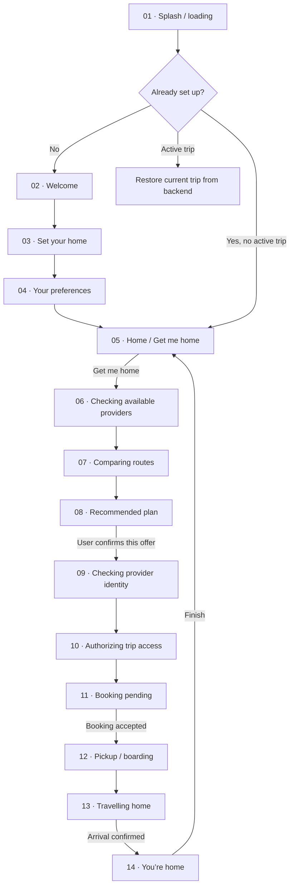
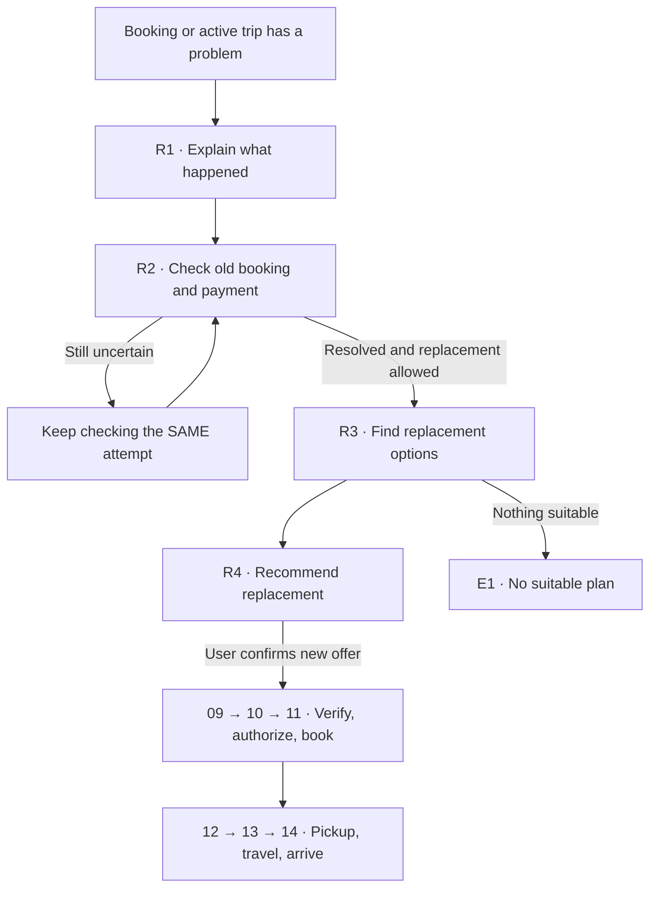

# Beacon — screen map

**Design source of truth · v1 · September 19, 2026**

Use the numbers below when discussing or designing screens. This defines the intended campus demo journey, not which screens are already implemented. Keep the existing ivory, forest-green and sage illustration style.

Basis: the approved provider-network pivot and team TODOs on main `ef8b2bd`. Replacement-confirmation and coordination details follow PR #23 at `bcf8d94`, still OPEN when checked. They are the intended design target, not a claim that its backend is merged. Shared contracts remain authoritative for implementation; update this map when agreed behavior changes.

## 1. The main journey



**Returning users skip onboarding. An active trip resumes its actual state.** Screens 06–07 update automatically while finding a plan. Screens 09–11 update automatically after the user approves screen 08. No extra Continue buttons or artificial waiting timers.

## 2. What belongs on each screen

| # | Screen | Simple layout, top to bottom | Main action |
|---|---|---|---|
| 01 | Splash / loading | Beacon logo → loading or restoring state | Automatic; show recovery if loading fails |
| 02 | Welcome | Logo → short purpose → campus artwork | Get started |
| 03 | Set your home | Title → home search/manual entry → selected address → small map if available | Save home |
| 04 | Your preferences | Budget → walking preference → transfer preference; explain unknown data when relevant | Save and continue |
| 05 | Home | “Let’s get you home” → current pickup + saved home → preference summary → main button | Get me home |
| 06 | Checking available providers | Status title → illustration → compatible services with pending/available status → privacy note | Cancel search |
| 07 | Comparing routes | Status title → route illustration → saved constraints + comparison progress | Cancel search |
| 08 | Recommended plan | Recommendation → service + actual operator → price/estimate and trip burden → expiry + key cancellation terms → simulation/source labels | Confirm this plan |
| 09 | Checking provider identity | Provider/operator → actual identity-check status/source → exact location still withheld | Cancel request |
| 10 | Authorizing trip access | Provider → identity result → trip access pending/result → separate simulated-payment status → what may be shared | Cancel request |
| 11 | Booking pending | “Requesting your ride” → chosen plan → provider booking pending → separate payment status | View details / request cancellation |
| 12 | Pickup / boarding | Actual pickup instructions → meeting point/map if supported → wait estimate with source → booking reference in details | Context-appropriate next action |
| 13 | Travelling home | Destination → real trip status → supported route/progress → arrival estimate if available | I’m home / Get help |
| 14 | You’re home | Arrival message → short trip summary + actual simulated-payment status | Finish → Home |

The exact service/operator, price, expiry, terms, payment state and instructions come from backend data. Never invent them to fill a design. Show “Pickup instructions unavailable” when needed.

## 3. The four screens we just designed

| Existing design | Where it goes now | Required correction |
|---|---|---|
| Checking nearby rides | **06** | Returned compatible services; truthful operator and simulation labels |
| Comparing your routes | **07** | Actual eligibility/offer validity; preserve unknowns |
| Confirming your provider | **09** | Identify actual operator; distinguish live verification from local demo trust |
| Preparing your trip | **10** | Separate access authorization from simulated-payment status |

**Screen 08 — recommendation and user confirmation — goes BETWEEN comparison and provider verification.** A provider check does not mean a booking has been accepted.

## 4. When the plan fails



| ID | What the user sees | Next step |
|---|---|---|
| R1 | Provider cancelled / request rejected / trip interrupted | Explain that Beacon is checking the old attempt |
| R2 | Checking whether the old booking or payment is still active; show known fees and remaining budget | Wait for confirmed resolution; no duplicate booking |
| R3 | Finding and comparing fresh options | Reuse 06–07 with replacement wording |
| R4 | New recommendation, changed terms, fees and remaining budget | Reuse 08; confirm this new offer |

Default: **a replacement needs fresh confirmation**. Skip it only if explicit bounded replacement permission exists in the agreed backend contract and covers this exact offer. Do not design automatic spending as the default.

## 5. Other paths — reuse layouts, not separate app sections

| ID | When | Screen/message | Where it goes |
|---|---|---|---|
| E1 | No feasible offer | No suitable plan; Try again / Change preferences / Get help | Fresh search, or Home; settle an existing attempt before starting another |
| E2 | Offer expired or terms changed | Offer changed; display fresh terms before approval | Refresh 06–08; no silent booking |
| E3 | Provider identity or access check fails | Couldn’t approve this provider; exact location withheld | Retry if permitted or find another eligible plan |
| E4 | Simulated payment declined | Clearly labeled simulated failure | Backend-approved retry or different plan; no accepted-booking claim |
| E5 | Booking/payment result unknown | Still checking your request | Reconcile the same attempt; never assume failure and book twice |
| E6 | Offline or reconnecting | Updates paused; last-known status/time if available | Reload authoritative trip state after reconnect; no offline booking or arrival confirmation |
| E7 | Session expired / trip unavailable | Cannot access this trip; recover session or explain next step | Restore access before acting; do not silently create a replacement |
| E8 | Location denied/unavailable | Explain need; allow supported manual pickup or retry permission | Return to Home/pickup setup; do not invent GPS |
| E9 | Slow/failed request | Couldn’t load latest information; Retry | Same operation/state; repeated taps must not duplicate bookings |
| E10 | Trip overdue | Are you home? → I’m home / Still travelling / Get help | Arrival or current trip; contact alert status shown only if reported |
| E11 | User cancels a booked/pending trip | Cancellation terms → confirm cancellation → cancellation pending → final result | Home only after backend resolves; unknown result stays E5/R2 |

Cancelling an unbooked search can return Home. Cancelling a submitted booking must not imply that the provider booking or payment has disappeared.

### Walking and scheduled transit

- **Walking:** 08 Confirm walking plan → 13 Walking home → 14 Arrival. Skip provider booking/payment steps when no provider booking is required. Show only supported walking guidance.
- **Scheduled transit:** 08 Confirm plan → 12 Get to stop / boarding guidance → 13 Travelling → 14 Arrival. Label timetable estimates as scheduled, not live. Use 09–11 only when that service actually supports and requires an authorized booking.
- Do not show a walking alternative’s full route as the route of a vehicle ride.

## 6. Small sheets that open on top

These are side panels/dialogs, not extra steps everybody must pass through.

| Sheet | Opens from | Contains / returns to |
|---|---|---|
| Edit home / pickup | 03 or 05 | Address selection → original screen |
| Edit preferences | 05 or E1 | Budget, walking, transfers → original screen; changes apply to a new objective unless backend explicitly supports editing the active one |
| Location permission explanation | 05, when location is needed | Plain explanation → system permission prompt → 05/E8 |
| Optional trip context | 05 | Supported temporary constraints → Home; not a required gate |
| Other options | 08 | Eligible alternatives → review chosen plan on 08; selection does not book |
| Plan / trip details | 08–14 | Operator, service, evidence/unknowns, terms, booking and payment status → original screen |
| Cancel confirmation | 09–13 when needed | Consequences and actual fees → E11 or resume |
| Help | Home, active trip, recovery, overdue | Clear emergency/non-emergency actions; Beacon is not an emergency service |
| Optional trusted contact | Preferences/settings | Supported contact setup + explicit notification consent; never send contact details to a transport provider |
| Judge/demo controls | Separate demo entry | Deterministic simulations and technical evidence; outside the student journey |

No mandatory account creation, Uber/Lyft linking, card-entry screen, wallet, marketplace, rail/air booking or unrelated bottom navigation in this demo. Real accounts/payments remain later work.

## 7. Reusable wireframe structure

```text
SETUP / HOME             PROGRESS                 RECOMMENDATION
┌──────────────────┐     ┌──────────────────┐     ┌──────────────────┐
│ Beacon / back    │     │ Beacon / demo    │     │ Beacon / back    │
│ Clear title      │     │ Current status   │     │ Recommended plan │
│ Short guidance   │     │ Short explanation│     │ Service/operator │
│ Artwork / map    │     │ State artwork    │     │ Price + journey  │
│ Fields / choices │     │ Status card      │     │ Terms + expiry   │
│                  │     │ Privacy/payment  │     │ Source / unknowns│
│ Primary action   │     │ Cancel / details │     │ Confirm plan     │
└──────────────────┘     └──────────────────┘     └──────────────────┘

ACTIVE TRIP              RECOVERY / ERROR         ARRIVAL
┌──────────────────┐     ┌──────────────────┐     ┌──────────────────┐
│ Beacon / help    │     │ Beacon / help    │     │ Beacon           │
│ Trip status      │     │ What happened    │     │ You’re home      │
│ Map if supported │     │ What is known    │     │ Arrival artwork  │
│ Pickup/progress  │     │ What happens next│     │ Trip summary     │
│ Plan + payment   │     │ Pending/resolved │     │ Payment status   │
│ Details / help   │     │ Next safe action │     │ Finish           │
└──────────────────┘     └──────────────────┘     └──────────────────┘
```

## 8. Design order

1. Reconcile **02–05** with current onboarding/home work; add just-in-time permissions.
2. Update **06–08**, especially the new offer/consent card.
3. Update **09–11**, with distinct identity, authorization, payment and booking states.
4. Design **12–14**: pickup, travel and arrival, including walk/transit variants.
5. Design **R1–R4** and **E1–E11** using the same layout families.
6. Finish sheets; verify the whole journey and all exits.

**Maintenance rule:** keep these IDs stable. Update this document before introducing a new screen or changing its destination. A completed design is not proof that its backend state works.
