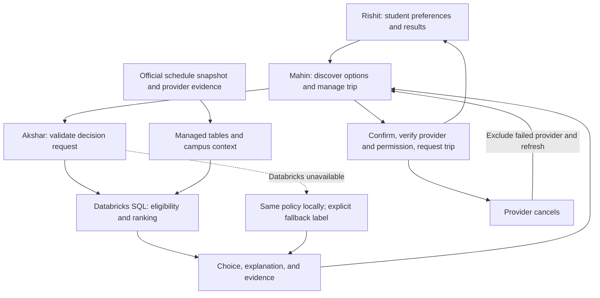

# Beacon — Databricks track PRD and build contract

**Owner:** Akshar · **Version:** 5 (expanded-pilot addendum; not completed) · **Date:** September 19, 2026

### Version 5: current local expansion

The [expanded-pilot status and exact team handoff](DATABRICKS_EXPANDED_PILOT_STATUS.md) supersede current-status claims below. The complete BT feed and 14-day service expansion, draft 50-direction pedestrian coverage matrix, lighting/waiting evidence helpers, unknown-transfer labels and latency tooling are implemented locally. The native full-feed import is a deployment candidate only. The wider pilot is **not deployed or finished**: 10/50 draft directions have sourced connectivity, operational lighting/pickup access remains unknown, and expanded ranking/shared interfaces need agreement. Version 4 below remains the runtime integration baseline; `beacon-v2` weights are unchanged. See the [implementation plan](DATABRICKS_PILOT_PLAN.md).

**Baseline inspected:** `main` at `d8f513a` (Mahin's demo provider agents merged).

This is the build contract for Beacon's logic/data track, extending the [product PRD](Beacon_Final_Hackathon_PRD.md). Shared `CandidatePlan` and `Recommendation` remain unchanged. Version 4 integrates the data-side exports into Mahin's existing backend with optional named-corridor input and owner-protected evidence; Rishit still owns the screens.

## Current implementation status and scope decisions

The decision/data backend includes personalized deterministic ranking, managed transit lookup, connected campus walking paths, mapped emergency resources, historical context, weather, sanitized audits and optional native AI briefing. Version 4 is based on Mahin's PR #14 head `dcaeedd`, preserving his trip/ANS/Telegram work. Actual cloud runs, statement IDs and limitations are in [live evidence](DATABRICKS_LIVE_EVIDENCE.md); local backend integration is not a deployed finished UI.

### Version 4 integrated contract (supersedes older completion status)

- **Expanded evidence:** 719 accepted 2026 crime-log rows across nine official PDFs/79 pages (717 distinct case IDs; incomplete coverage and one quarantined row); 1,179 community lighting objects, not verified working lights; four historical pedestrian summaries; 14 official construction areas; 65 mapped AED/bleeding-control resources; 20 official notice-page records; current NWS context. These supplement official transit, 130 mapped phones and the campus path network. See [data contract](DATABRICKS_DATA.md).
- **Actual route benefit:** construction-aware connected walks, preserving the original public endpoints: Newman–Pritchard 1,077.34m and Eggleston–Pritchard 626.55m. Each adds 22.29m to avoid currently dated published work areas. This is conservative avoidance, not proof that every remaining path is open or safe. Rebuild after construction evidence expires; no fabricated fallback path.
- **Backend integration:** optional `corridorId` accepts the two campus routes only and verifies endpoint proximity locally. Discovery includes a mapped walk and, in demo mode, a managed timetable option with explicit 3+3-minute stop-walk assumptions. One rich evaluation returns a choice plus source-backed explanation/map/safety evidence. Confirmation, provider verification, cancellation recovery and notification gates remain Mahin's implementation. [API handoff](DATABRICKS_APP_HANDOFF.md).
- **Native data:** a bounded serverless Spark import writes raw provenance archives plus typed public-evidence records, with a completion marker only after verification. Empty provider-outcome storage and an idempotent ingestion contract are ready; real history remains unknown, not seeded. [Import runbook](../databricks/NATIVE_PUBLIC_IMPORT.md), [provider outcomes](DATABRICKS_PROVIDER_OUTCOMES.md).
- **Honest safety:** strict source/route/freshness validation, current walking blocks and missing-coverage warnings. `routeExposureScore: null` and `scoreStatus: unavailable` remain correct because measured lighting/current activity/complete incident coverage are absent. [Safety contract](DATABRICKS_SAFETY_EVIDENCE.md).
- **Research:** optional bounded official-source retrieval with a provider-neutral search interface. Native web-search-compatible models were not available in this workspace; no extra service enabled. Pages/snippets cannot directly change ranking. [Research contract](DATABRICKS_WEB_RESEARCH.md).
- **Remaining product dependencies:** Rishit's [PR #16](https://github.com/aksharkakkad-web/VTHacks/pull/16), `feat/beacon-design-system` at `17fa00f`, is now visible with green CI. Its own handoff describes a frontend simulation; the map is illustrative SVG, not our actual route geometry. Connect its views to Mahin's Trip API and the evidence endpoint, then verify a combined UI journey. Mahin's [PR #15](https://github.com/aksharkakkad-web/VTHacks/pull/15) reports the hosted backend still lacks Databricks server credentials, so local real-SQL acceptance is not hosted acceptance. Real provider participation, observed reliability, verified stop-access walks, arbitrary-address routing, measured lighting and live pedestrian data remain outside demonstrated capabilities. No deployment or main merge is implied.

### Version 3 historical completion contract

- **Data:** two supported walking corridors from 1,970 official VT pathway features; 130 mapped phones; official GTFS and $0 fare; next-day hourly weather/alert windows; 12 selected historical reports. Route matching uses connected geometry, phone proximity and exact named endpoint places—not invented crime scores. Downtown walking is explicitly unsupported.
- **Personalization:** budget and walking limits are hard constraints; explicit price/walking/transfer preferences change ranking; canceled providers and expired quotes are excluded. Severe forecast weather excludes walking-only options; known closures exclude affected walking. Unknown conditions stay unknown.
- **AI:** existing native `databricks-meta-llama-3-3-70b-instruct` via `ai_query` selects/orders verified fact IDs: actual cost, time, alternative tradeoffs, source-backed context. It cannot change the winner, invent prose, override permissions or omit mandatory source/coverage warnings. Invalid output or timeout uses a labeled template fallback. AI is optional (12-second normal bound, 60-second cold-start demo bound).
- **Freshness:** native serverless refresh writes public weather/transit/phones/fare evidence, not student data. It uses forecast issue time, exact alert intervals and current source hashes, so old canceled alerts/removed bus trips cannot silently resurface. The finite hackathon schedule and notebook cutoff prevent indefinite refresh. Static route/incident snapshots remain explicitly dated.
- **Acceptance:** unit/importer/job tests, repository lint/typecheck/build, live SQL/audit tests, live managed-route + budget-change + model briefing, and a successful native job. Results—not promises—are in the evidence document.
- **Not part of backend completion:** teammates wiring APIs/screens, real provider participation/bookings, arbitrary-address routing, comprehensive crime feeds, measured lighting/phone operation, learned reliability, or automatic audit deletion. No claim that these are implemented. Audit deletion requires separate approval; sponsor registration remains a team action.

Exact commands/contracts: [Databricks runbook](../databricks/README.md). Verified source coverage: [data contract](DATABRICKS_DATA.md). Judge sequence: [judge guide](DATABRICKS_JUDGE_DEMO.md).

Akshar's later scope decisions supersede the initial transit-only proposal and template-only explanation restriction: prioritize cost and evidence-based safety context, add mapped walking alternatives and grounded native AI curation. No slope routing, invented lighting, or learned crime prediction. Native AI stays outside ranking. Sections below retain the design baseline except where these implemented contracts explicitly replace it:

- `maxBudget` is dollars, normalized internally to cents; invalid requests throw (not an `INVALID_INPUT` result).
- `beacon-v2` is default. Baseline scoring plus rain walking multiplier 1.5 and verified-unlit penalty 3/minute; `beacon-v1` omits those penalties. Walking weights are 1/4/6; transfer weights 4/8, not the previously proposed 10.
- Priority is `balanced`, `lowest_cost`, or `less_exposed` (means less walking, not measured crime safety). Cost-first emits `LOWEST_COST`; others emit `LOWEST_POLICY_SCORE`.
- `local` is the pure reference function; server outage results are `local_fallback`. Version 4 adds the backend handoff described above, not UI implementation.
- Real direct corridors are Newman Library → Pritchard and East Eggleston → Pritchard. No verified direct downtown itinerary is claimed. Friday Newman service does not imply Sunday service; Eggleston supports the weekend in the captured feed.
- Managed schema: public_snapshots, source_manifest, incident_reports, emergency_phones, transit_departures, route_context, route_evidence, decision_events, public_research_snapshots, public_research_items, public_evidence_records, public_research_imports and provider_outcomes. No fake provider history is seeded.
- Executable runtime policy/query live in `src/lib/decision-client/decision.ts` and `src/integrations/databricks/sql.ts`; importer is `databricks/ingest/refresh_campus.py`; fixture assertions are `databricks/demo.mjs`. Proposed artifact names later in this baseline are not additional required files.
- Baseline requirements not yet implemented: automatic audit retention cleanup, finished UI/deployed integration, and actual independently observed provider history. The backend API wiring and outcome ingestion contract are implemented; they do not establish real-world operation.

## 1. The project in plain English

The student says, “Get me home.” Mahin's part gathers possible rides and transit options. **Our part compares them, chooses one that fits the student's needs, and explains why.** Rishit's app shows that answer. Mahin handles confirmation, provider verification, requesting the ride, and monitoring it. If the ride cancels, our part chooses again without picking the failed provider.

The winning demonstration is not “we connected a database.” It is: **campus data changes a useful decision, we can show the reasoning, and the system recovers when the first plan fails.** Beacon supports transport decisions; it does not guarantee safety or replace emergency services.

## 2. Confirmed sponsor fit

The **VTHacks 14 Opening Ceremony**, slide 68, explicitly offers **Campus Life Intelligence Hub**: combine campus services into a personalized student experience using Databricks-backed insights and timely recommendations. Beacon is a focused mobility slice of that hub, not a claim to have integrated every campus service.

| Sponsor criterion from slide 68 | What we will actually show |
| --- | --- |
| Originality and realistic recommendations | A choice that respects budget/walking needs, followed by recovery from a cancellation |
| Effective Databricks use and Deloitte-style technology consulting | A real SQL evaluation joining candidate plans with campus context; explain why this architecture fits a campus pilot |
| Potential student impact | A concrete student journey; measure demo outcomes without inventing real-world adoption or safety benefits |
| Technical execution and scalability | A working bounded evaluator, data provenance, explicit fallback, and campus-specific configuration |
| Deployment roadmap and future enhancements | MVP → permissioned campus pilot → multi-campus rollout, with operational requirements at each stage |
| Teamwork, demo, communication, and Q&A | Three clear responsibilities, visible handoffs, evidence of the decision, and honest limits |

**Required human action:** slide 69 asks competitors to complete the Deloitte × Databricks challenge registration/participant agreement via its QR code. Verify the team has done this and obtain any additional official rules. Reading the slides is not registration or confirmed eligibility.

The public event page still had sponsor details marked unannounced when checked. Use the provided opening deck for the challenge description, not an older year's challenge. Source details are in section 16.

## 3. What exists versus what we are building

| Area | At the inspected commit | This track's next deliverable |
| --- | --- | --- |
| Provider options | Mahin has local HTTP demo providers, normalized `CandidatePlan`s, and tests | Consume those options without redesigning provider agents |
| Choice/result | Shared `Recommendation` type exists; no Databricks evaluator | Deterministic evaluator plus a real SQL-backed adapter |
| Freshness | Provider normalization checks `expires_at` if supplied, then drops it | Preserve collection/expiry evidence alongside each plan |
| No valid choice | `Recommendation` requires a winner | Add a result envelope that can explicitly say no suitable option |
| Reliability | Providers can supply a number | Distinguish demo values, provider claims, and observed performance |
| Campus data | No verified imported transit dataset | Import a small official Blacksburg Transit schedule slice |
| Databricks access | Environment-variable placeholders only | Verify workspace, permissions, warehouse, and a real query |
| End-to-end app | Foundation and provider code, not a complete student flow | Integrate at the shared A–G checkpoints |

The table above describes the original base commit, not the current local branch. Real GTFS feed validity and supported campus corridors have now been verified; see the data contract. Never report real bookings or live arrival estimates based on fixtures.

## 4. Scope and technical decisions

### Must ship, in order

1. **A testable decision contract:** mock options in; a valid choice, explanation, and audit breakdown out. No forced choice when nothing qualifies.
2. **Real Databricks ranking:** SQL filters and scores the submitted candidates, returns the winner and runner-up, and records which policy/data versions were used.
3. **Cancellation recovery:** remove the failed provider, refresh options, evaluate again, and explain the replacement.
4. **Meaningful campus data:** verified direct Newman/Eggleston → Pritchard bus corridors; real schedules affect eligibility/waiting time. Preserve the frozen downtown provider demo separately, without inventing a downtown bus connection.
5. **Judge evidence:** show each option's eligibility, score components, source labels, and the reason the winner changed.

All five are the target demo. If real-data access blocks item 4, finish the working evaluator and label simulated transit clearly; that is a reduced demo, not completion of the real-data goal.

### Chosen architecture

| Decision | Baseline | Why |
| --- | --- | --- |
| Decision engine | Deterministic SQL on a Databricks SQL warehouse | Easy to prove, explain, test, and connect to actual campus tables |
| Local equivalent | TypeScript reference evaluator using the same versioned policy | Unblocks teammates and provides a truthful outage fallback |
| Data storage | Small Unity Catalog managed Delta tables plus versioned source snapshots | Enough provenance and repeatability without building a giant platform |
| App integration | Server-only REST Statement Execution API | No browser credentials; no extra model-serving service |
| Personalization | Explicit preferences and constraints | Predictable choices, not inferred diagnoses or hidden profiling |
| Explanations | Exact calculated/source-backed facts, optionally curated by native AI | AI chooses fact IDs, never the winner or new claims |
| Campus dataset | Official scheduled transit first | Directly useful to the product and realistic within this hackathon |
| Account/cost | Existing sponsor workspace if available; otherwise evaluate Free Edition | No paid upgrade or new paid service assumed |

Do **not** build an LLM that chooses the winner, a vector database, RAG, model training, a second trip-orchestration system, or a generalized multi-campus route planner for this demo. The existing native model endpoint handles evidence curation; no custom serving deployment or training is needed. Python is used for source ingestion and the native refresh notebook, not a second application server.

**Showcase:** real mapped walking alternatives, personalized price/walking comparisons, grounded `ai_query` briefing, budget/preference what-if SQL, phone map/proximity/H3, source freshness, native refresh, and recent decision evidence. Native `ai_extract` remains an optional three-row public-data experiment. No learned crime model or safety guarantee.

## 5. Architecture and ownership



| Owner | Responsibility and boundary |
| --- | --- |
| Akshar | `databricks/**`, `data/**`, `src/integrations/databricks/**`, `src/lib/decision-client/**`; policy, campus data, query adapter, explanations, ranking tests |
| Mahin | Provider discovery, preserving quote evidence, trip APIs/state, current objective version, cancellation exclusion, provider trust/authorization, bookings and monitoring |
| Rishit | Preferences, result presentation, no-option/emergency/fallback views, demonstration controls and visible provenance |
| Shared integration | Additive decision types, environment entries, dependencies, API response mapping, and demo values; coordinate before changing shared files |

Original proposed artifacts (actual implemented paths are in the status section and runbook):

- `databricks/sql/bootstrap.sql`: managed schema/tables/views.
- `databricks/sql/evaluate.sql`: parameterized eligibility and ranking query.
- `databricks/notebooks/import_transit.py`: bounded source import/normalization.
- `data/policy/beacon-v1.json`: coefficients, limits, and policy version.
- `data/fixtures/decisions/`: baseline, cancellation, constrained-budget, and no-option cases.
- `src/lib/decision-client/`: request validation, local evaluator, explanation builder, and parity tests.
- `src/integrations/databricks/`: server-only statement client, result validation, and audit writer.
- `src/types/decision.ts`: proposed additive shared envelope, implemented with Mahin.

Do not replace `CandidatePlan`, change existing trip API paths, or make the UI call Databricks directly.

## 6. Decision contract

Logical call: `evaluateCandidates(candidates, context, evidenceByPlanId) -> DecisionResult`.

Keep the existing `CandidatePlan` and successful `Recommendation` shapes. Add metadata in a sidecar and wrapper instead of forcing the three tracks to rewrite their current code.

**Context:** random `evaluationId`; `objectiveVersion` (currently `0` for Mahin's immutable-objective trip API; monotonically increasing mutable objectives require a future shared-contract change); server-captured evaluation time; budget in cents; `minimizeWalking`; `minimizeTransfers`; optional hard `maxWalkingMinutes`; excluded provider IDs; coarse corridor ID; explicit emergency flag; optional derived reduced-walking preference. No exact coordinates, student identity, contact details, or raw sensitive free text.

**Per-plan evidence:** `collectedAt`, `validUntil`, source kind (`simulated`, `scheduled`, `mapped`, or `live`), source/data version, whether service availability is established, transfer-count provenance, and optional matching transit trip/stop identifiers. `mapped` is only a dated walking estimate, not live navigation. Missing evidence is not silently treated as live data. Mahin owns preserving the quote evidence; Akshar validates and uses it.

**Result states:**

| Status | Payload and behavior |
| --- | --- |
| `RECOMMENDED` | Existing `Recommendation`, ranked eligible candidates, rejected candidates/reasons, and score components |
| `NO_FEASIBLE_PLAN` | No selected plan; explain which constraints ruled options out; UI can offer changing settings or campus resources |
| `EMERGENCY` | No optimization; hand control to the existing emergency-help flow; do not automatically contact anyone |
| Thrown validation error | Caller catches/maps to its existing error response; no selected plan or provider action |

Common metadata: evaluation/objective IDs, `policyVersion`, `evaluatedAt`, engine (`databricks`, `local_fallback`, or `boundary`), data/source versions, warnings, and audit persistence status. `boundary` applies to requests resolved before an engine call. Include the Databricks statement ID when one exists.

Mahin accepts a result only for the current `objectiveVersion` and still-valid candidate snapshot. A late answer must not resurrect a canceled choice. Recheck expiry before acting; an expired winner requires fresh discovery, not an expired booking. `requiresProviderVerification` means verification is still required, **not that verification passed**.

For integration, map no-option/invalid cases to the existing failure/status-message path without inventing a new `TripState` in this document. Agree on the emergency UI response at checkpoint A. Never manufacture a `selectedPlanId` to satisfy the old success-only type.

## 7. Eligibility and scoring policy: `beacon-v1`

### First decide whether an option is allowed

1. An explicit emergency flag short-circuits before Databricks/network ranking. This is not an automated medical assessment.
2. Reject malformed requests: missing/invalid budget, duplicate plan IDs, invalid context. An empty candidate list is valid and returns no feasible plan.
3. Reject individual malformed candidates without discarding otherwise valid options: non-finite/negative values, inconsistent total duration, invalid transfer counts, missing required evidence.
4. Exclude unavailable, expired, canceled/excluded, out-of-service-area, known non-operating, over-budget, and over-hard-walking-limit options.
5. Rank only the remaining options. Budget equality is allowed; zero budget is valid. A walking preference is a penalty, **not** an absolute walking ban. The optional walking cap is the hard limit.

Mahin's discovery currently appends a walk option; it must still pass these checks. An unverified provider may be evaluated, but known failed/denied providers are excluded and no precise data or request is released by this track.

**Quote freshness:** preserve source expiry; effective validity is the earlier of source expiry and 120 seconds after collection. Real provider quotes without expiry/collection evidence are not usable until the adapter supplies an explicit source policy. Demo fixtures may use a generated 120-second expiry and must say simulated. Scheduled transit has separate service-date validity; a recently fetched file alone does not prove a trip runs today.

### Then choose the lowest transparent score

The score is a convenience tradeoff expressed in weighted minutes, **not a safety probability or learned prediction**:

```text
score = waitMinutes + travelMinutes
      + walkingWeight × walkingMinutes
      + 2 × costDollars
      + transferPenalty × transfers
      + 20 × (1 - reliability)
```

| Policy parameter | Default | User preference |
| --- | --- | --- |
| Walking weight | 1 | 4 for minimize-walking; 6 for explicit `less_exposed` priority |
| Transfer penalty | 4 minutes each | 8 for minimize-transfers |
| Cost weight | 2 weighted minutes per dollar | Budget remains a separate hard ceiling |
| Reliability penalty | Up to 20 weighted minutes | No provider reliability penalty for providerless walking |

Use the larger applicable preference weight, not the sum. Do not infer intoxication, disability, anxiety, or health conditions. Derive the preference before persistence; do not retain the sensitive statement itself. These coefficients are an explicit product heuristic for this demo and can be revised only with a new policy version and updated expected tests.

**Reliability source order:** fresh observed provider outcomes, explicitly labeled scenario fixtures in demo mode, otherwise neutral `0.5` plus `RELIABILITY_UNKNOWN`. Provider self-reported reliability is not observed performance. For future observed data, use the last 30 days with `(completed + 5) / (completed + canceled + 10)` and a snapshot no older than 24 hours. Do not fabricate completed-trip history to fill this table. Transfer counts for a real transit option come from its validated itinerary; an unknown count must not masquerade as a verified zero-transfer route.

**Numerical agreement:** validate monetary input to cents; normalize durations to whole seconds and reliability to basis points using nonnegative half-up rounding. Compute an integer score in hundredths of a second:

```text
scoreUnits = 100 × (waitSeconds + travelSeconds
                   + walkingWeight × walkingSeconds
                   + 60 × transferPenalty × transfers)
           + 120 × costCents
           + 12 × (10000 - reliabilityBasisPoints)
```

Omit the final term for providerless walking. SQL and TypeScript must use these same normalized values; display `scoreUnits / 6000` as weighted minutes. Break ties by walking seconds, cost cents, total seconds, then ordinal `planId`; never by incoming array order. Compare totals after the same normalization with at most one-second rounding tolerance.

### Frozen scenario expectations, not hard-coded winners

For the shared $10/minimize-walking scenario, zero transfers, and **simulated** reliability values:

| Option | Cost | Wait / travel / walk, minutes | Scenario reliability | Score |
| --- | --- | --- | --- | --- |
| Campus Ride | $0 | 8 / 11 / 1 | 0.98 | 23.4 |
| Independent Ride | $7 | 5 / 10 / 1 | 0.94 | 34.2 |
| Transit | $0 | 15 / 14 / 5 | 0.94 | 50.2 |
| Walk | $0 | 0 / 0 / 22 | Not applicable | 88.0 |

Expected sequence: **Campus Ride → cancel Campus Ride → Independent Ride → lower budget to $6 → Transit**. For that final comparison Campus Ride remains excluded. A hard walking cap below all remaining options returns no feasible plan. Real imported schedules may change the transit values and winner; do not overwrite real data to preserve a scripted outcome.

### Explain the calculation honestly

Always include `LOWEST_POLICY_SCORE`; add factual reasons only when their conditions hold: `WITHIN_BUDGET`, `LESS_WALKING_THAN_RUNNER_UP`, `FEWER_TRANSFERS_THAN_RUNNER_UP`, `REPLANNED_AFTER_PROVIDER_FAILURE`, `SCHEDULED_TRANSIT`, `RELIABILITY_UNKNOWN`, `FALLBACK_USED`. Emit comparison reasons only after comparing the actual fields. Separate user-facing reasons from debug warnings.

Example baseline: “Campus Ride fits your $10 budget and involves 1 minute of walking. It has the best overall match for your settings.” Do not call it the fastest, cheapest, or safest unless the relevant factual comparison actually supports that wording; never call a route safe based on this score. Keep the primary explanation short and put the calculation in an expandable evidence panel.

## 8. Campus data: small, real, and decision-relevant

Use the [Virginia DRPT GTFS clearinghouse](https://drpt.virginia.gov/data/gtfs-feed-clearinghouse/) as the official discovery source for Blacksburg Transit. It lists a feed at `http://www.bt4uclassic.org/gtfs/google_transit.zip`; accessibility, current validity, and permitted reuse still need verification. Prefer a working official HTTPS endpoint if available; do not silently substitute an unrelated dataset.

Download once, retain a source hash, and import a limited snapshot. Do not make live external fetching part of every recommendation. A SQL join to an imported scheduled trip is enough to demonstrate real data use; it is **not** a live vehicle arrival prediction.

| Data object | Minimum purpose/fields |
| --- | --- |
| `source_manifest` | Source URL, file hash, import time, source kind, service-date coverage, usage attribution |
| `provider_stats` | Provider ID, observed/demo provenance, counts, average delay if known, snapshot time/version |
| `campus_corridors` | Coarse origin/destination zones, validated boarding/alighting stops, explicit access/egress walking estimates |
| GTFS normalized tables | Needed stops, routes, trips, stop times, service calendars, and calendar exceptions |
| `scheduled_options` view | Corridor/service date/trip, feasible departure/arrival, walking, wait, travel, transfers, source version |
| `decision_events` | Evaluation ID, policy/objective versions, sanitized candidate snapshot, eligibility/scores/result, engine, timings, and source versions |

Use UTC for audit timestamps and the feed's agency timezone for service calculations. Follow the [GTFS schedule reference](https://gtfs.org/documentation/schedule/reference/): exceptions override weekly calendars, service times can exceed 24:00, and boarding must precede alighting on the same feasible itinerary. Include access walking before determining whether a departure can be caught; total walking includes access and egress, and waiting must not double-count access time.

Start with a verified direct-trip corridor. Do not build transfer routing merely because the schema supports transfers. If the desired demo corridor is unsupported, show no scheduled transit for it or choose a team-agreed supported corridor; do not invent a bus connection. If service is invalid on judging day, a historical scenario clock is permitted only with a prominent simulation label and original service date.

A Databricks query must actually use the imported schedule to produce or validate transit availability/timing. Loading a CSV and ranking unrelated hard-coded options does not satisfy this real-data acceptance criterion.

Keep decision audits free of exact GPS, names, trusted contacts, credentials, and raw sensitive preferences. Use random evaluation IDs and a short-lived mapping inside the trip system if needed. Retain sanitized hackathon decision events for seven days; provide a cleanup command, and execute deletion only with approval. Deduplicate retries by evaluation ID in the read view; do not assume Delta primary-key enforcement or promise exactly-once writes.

## 9. Databricks connection and runtime behavior

1. Verify an available workspace, chosen user/profile, warehouse access, `SELECT 1`, and ability to create/read the project schema. Prefer sponsor-provided access; otherwise verify Free Edition suitability. Free Edition is quota-limited and is not a production availability commitment. [Official limitations](https://docs.databricks.com/aws/en/getting-started/free-edition-limitations).
2. Keep `DATABRICKS_HOST`, `DATABRICKS_TOKEN`, and `DATABRICKS_WAREHOUSE_ID` server-side in ignored local configuration. Verify supported authentication in the actual workspace; if a different auth method is required, coordinate the environment change. Do not ask the user to paste secrets into chat.
3. Send static SQL with named parameters, including serialized candidate/context payloads; parse using an explicit schema. Never concatenate provider text into executable SQL. Use one configured workspace host, not a host supplied in a request.
4. Use the [Statement Execution API](https://docs.databricks.com/api/statement-execution/v1/statement-execution). Check the statement's status, not just HTTP success; validate returned rows, identifiers, and result completeness before accepting a winner. Keep results inline and bounded to at most 16 candidates and 64 KiB of request payload.
5. Submit asynchronously (`wait_timeout: "0s"`), then poll at 250 ms, 500 ms, and up to 1-second intervals within a **10-second total evaluation deadline**. Cancel a known still-running statement when abandoning it. Permit at most one transient transport retry inside the deadline; respect rate-limit delay, never retry bad credentials in a loop, and do not create unlimited duplicate statements.
6. Attempt an idempotency-keyed audit append with a separate **8-second budget**, increased after the real Free Edition MERGE repeatedly exceeded two seconds. Recheck quote expiry after that wait. Audit failure warns and does not destroy a valid recommendation. Do not rely on an unawaited serverless promise to persist evidence.

The [SQL execution tutorial](https://docs.databricks.com/aws/en/dev-tools/sql-execution-tutorial) documents parameter binding and asynchronous operation. The above time budgets, limits, and retry policy are Beacon decisions, not platform guarantees. Cold-start latency must be measured. The judge presentation should warm the warehouse shortly before the demo, without pretending the cold-start limitation does not exist.

Agents handle normal installation, code, queries, and tests within the approved project workflow. The user handles account verification, credentials/login interaction, participant agreements, and any paid-service decision. We do not assume an agent can create an account and accept its terms unattended.

## 10. Outages and recovery

- **Databricks unavailable/too slow:** run the same local policy with the submitted fresh quotes and the most recent valid context snapshot, at most 24 hours old and still within service-date coverage. Label the engine `local_fallback`; show “Advanced context temporarily unavailable.” If no valid transit context exists, omit that transit option rather than inventing it.
- **No observations:** use neutral reliability and explain that performance history is unavailable. Do not turn missing history into a negative claim about a provider.
- **No valid options:** return no feasible plan; offer settings changes or campus resources without automatically relaxing the user's constraints.
- **Provider cancels:** Mahin adds the failed provider to exclusions, refreshes quotes, and calls the evaluator while preserving `objectiveVersion: 0` in the current immutable-objective API. Mutable objectives with an incremented version are a future coordinated contract, not current behavior. Akshar returns a new decision; Mahin still owns confirmation/authorization requirements before action.
- **Old answer arrives:** ignore it if its objective version is no longer current. Do not cache a recommendation across different candidate snapshots or objective versions.
- **Audit write fails:** keep the valid choice, expose `auditPersisted: false`, and report the evidence gap. A fallback/local event does not count as proof of live Databricks execution.

With identical normalized inputs, policy, clock, and data snapshot, local and SQL engines must agree. Different/missing context may legitimately produce different results; metadata must make that visible.

## 11. Definition of done and essential tests

Automate the critical cases below. These are boundaries of the demo, not a mandate to spend the hackathon on every conceivable edge case.

| Test group | Required proof |
| --- | --- |
| Baseline and recovery | Fixture scores above; Campus → Independent after exclusion; remaining Transit after budget drops to $6 |
| Constraints | Zero/exact budget, expired quote, unavailable/excluded provider, hard walking cap, and no feasible result |
| Validation | Duplicate IDs invalidate request; NaN/negative/inconsistent candidate values cannot win |
| Emergency | Explicit emergency returns before network ranking and does not trigger an automatic booking/contact |
| Determinism | Reordered candidates and ties yield the same result; SQL/local parity on fixtures plus a small seeded generated set |
| Policy sanity | Increasing one option's cost cannot improve its own score; explanations match actual comparisons |
| Data truth | Demo/live/scheduled labels survive to the result; unknown reliability is not presented as observed |
| Schedule correctness | Service exception, overnight `25:10` time, access-walk boarding feasibility, and downstream stop ordering |
| API failure | HTTP-success/statement-failure, pending timeout, credentials failure, malformed/truncated results, and canceled-query handling |
| Integration | Old objective ignored, winner expiry rechecked, failed provider never reselected, provider verification still required |
| Audit/privacy | Decision remains usable on logging failure; persisted payload contains no prohibited personal fields or secrets |
| Real sponsor proof | A live statement uses a real imported context row; changing a relevant input changes the outcome for an explainable reason |
| Demo reliability | Three consecutive full runs including cancellation; record measured latency and any fallback usage |

Performance goals: local evaluation under 100 ms at the 16-plan cap; aim for warm live evaluation under 3 seconds, but retain the 10-second deadline and measure actual results. Report sample size and cold versus warm runs; three demos do not establish production p95 reliability.

## 12. Build sequence and team checkpoints

These are engineering timeboxes, not promises or extra meetings. Start mocks immediately; account access can progress alongside local coding. If an integration consumes its timebox without working, preserve the working core and make the limitation visible.

| Order | Akshar's deliverable | Timebox | Team handoff |
| --- | --- | --- | --- |
| 1 | Request/result fixtures, policy, local evaluator, tests | 45–60 min | A: Mahin can call it; Rishit can show success/no-option/fallback |
| 2 | Workspace probe and minimal real statement | 30–45 min, alongside step 1 where possible | Access evidence, not a blocked frontend |
| 3 | SQL ranking, server adapter, audit row, parity checks | 60–90 min | B/C: real provider-shaped options enter; real Databricks choice leaves |
| 4 | Failed-provider exclusion and objective-version integration | 30–45 min | F logic ready; coordinate with Mahin's recovery flow |
| 5 | One official schedule corridor affecting the query | 60–90 min maximum initial attempt | Strengthens C; real-data versus demo labels visible |
| 6 | Evidence view payload and short consulting roadmap | 30–45 min | Rishit presents why the choice changed |
| 7 | Three full runs and deploy-team handoff | 30–45 min | G: repeatable integrated demo, with live/fallback status recorded |

D and E are primarily Mahin/Rishit's provider-verification and trip-monitoring work. Akshar supports the existing result through those transitions rather than building another monitoring system. The implementation order can prepare F before D/E are integrated; it does not mark those shared checkpoints complete.

Follow [the shared checkpoint rules](CHECKPOINTS.md). After our slice is checked, update only `checkpoints/akshar.json` in that implementation PR. The board signals readiness after merge to `main` and green CI; all-three-ready triggers a 10-minute sync. **Keep working while teammates finish.** A planning document alone does not complete a checkpoint. Notification delivery depends on GitHub settings; local progress is not automatically announced without the checkpoint update.

## 13. How the coding agent should iterate

Use this loop for each deliverable: **read its acceptance case → implement the smallest slice → run focused tests → fix failures → show evidence → integrate at the matching checkpoint**.

- Use local fixtures for rapid iterations; run live Databricks checks after meaningful integration changes, not on every edit.
- Do not silently loosen tests or change policy to make a broken implementation pass. Add a regression for a real defect; version deliberate policy changes.
- Finish one usable slice before optional features. When a timebox runs out, state exactly what works and the narrow blocker.
- Run the repository's normal pre-PR checks for code changes. Never mark a live integration done from a mock test.
- Continue routine work without asking the user to run shell commands. Pause only for genuinely missing authority or human-only account/terms/cost steps.
- Push/merge/deploy only when explicitly authorized for that change; this PRD is not blanket permission for paid resources or external publishing.

## 14. Four-minute judge story

1. **Problem, 20 seconds:** students should not have to compare disconnected campus transport options while tired and trying to get home.
2. **Personalized decision, 60 seconds:** enter a budget and walking preference; show options and the real Databricks recommendation. Open “Why this?” to show source labels and actual score components.
3. **Recovery, 45 seconds:** cancel the selected simulated provider; visibly exclude it and show the next choice with a changed explanation. Be explicit that providers are demo services if they remain simulated.
4. **Data makes a difference, 40 seconds:** demonstrate the imported schedule affecting an option, or change budget/preference and show the recalculated outcome. Do not present a scheduled departure as live vehicle tracking.
5. **Consulting case, 45 seconds:** explain a scoped campus pilot, who must participate, metrics, and why the architecture can expand without claiming it already has.
6. **Close, 30 seconds:** name the three contributions, show repeatable evidence, and state the next practical deployment step.

Have one saved, sanitized decision trace as backup. A replay must say replay; it is not a live query. Demonstrate one strong differentiated behavior rather than listing unused Databricks products.

## 15. Deployment and impact roadmap

| Stage | Capability | Requirement before calling it real |
| --- | --- | --- |
| Hackathon MVP | One corridor, bounded choices, explainable ranking, simulated provider cancellation | Successful real Databricks query; clearly labeled provider/data sources |
| Campus pilot | Actual participating transport services, refreshed schedules, authorized trip workflows | Provider agreements, campus stakeholder review, secure auth, consent/retention policy, monitored operation and budget |
| Measured improvement | Observe cancellations/delay and tune policy using opt-in outcomes | Adequate representative data, user feedback, bias/accessibility review, and comparison against a baseline |
| Multi-campus | Configuration-driven zones/providers, per-campus policies, isolated data | Operational ownership, access controls, capacity/cost tests, refresh SLAs, and support process |

Potential stakeholders: campus transportation, student affairs/accessibility representatives, participating providers, and the campus data/IT team. These are proposed partners, not established relationships.

Measure recommendation latency, feasible-choice rate, replan success in tests, provenance coverage, and audited decisions. For the scripted scenario, show calculated walking/time/cost differences and identify them as simulated. Do not claim reduced incidents, actual student adoption, real-world money saved, or production reliability without evidence.

## 16. Sources, deadlines, and remaining external checks

**Primary sponsor source:** user-provided `VTHacks 14 Opening Ceremony.pptx`, found in Downloads; 90 slides. SHA-256: `2087d3ce7308d665912efd774fc60fc9556ae730e699fc320bc2b77f535d60a3`. The duplicate filename ending `(1).pptx` had the same hash. The large deck is not copied into this repository.

- Slides 64–67: Deloitte × Databricks alliance and platform framing.
- Slide 68: the three challenge choices and sponsor judging criteria; confirms Campus Life Intelligence Hub.
- Slide 69: challenge registration and participant agreement QR.
- Slide 11: submission by **8 AM Sunday, September 20**, plus participation requirements.
- Slide 12: judging shown as **9 AM Sunday at NCB**. The [public Devpost page](https://vthacks-14.devpost.com/) showed a different judging window when checked. Plan to be ready by the earlier time; confirm the final schedule in the hacker app or with organizers.

Technical sources: [Free Edition limits](https://docs.databricks.com/aws/en/getting-started/free-edition-limitations), [Statement Execution API](https://docs.databricks.com/api/statement-execution/v1/statement-execution), [parameterized SQL tutorial](https://docs.databricks.com/aws/en/dev-tools/sql-execution-tutorial), [official Virginia transit feed directory](https://drpt.virginia.gov/data/gtfs-feed-clearinghouse/), [GTFS reference](https://gtfs.org/documentation/schedule/reference/). Databricks skills inform implementation workflow; they are not a substitute for live workspace verification or runtime dependencies.

**External checks still open:** team sponsor registration/rules, final judging time, teammate UI/API integration, and visual verification of the saved dashboard. Workspace access, schema permissions, live ranking/audits, feed coverage, and direct campus demo corridors are verified. No paid upgrade was made.

**Next integration:** Mahin imports `evaluateTrip` / `getScheduledTransitOption`; Rishit shows the returned recommendation, source/engine labels, and three result states. Invalid requests throw at the API boundary. Preserve objective-version and provider-permission gates. This track does not implement their trip orchestration or screens.
