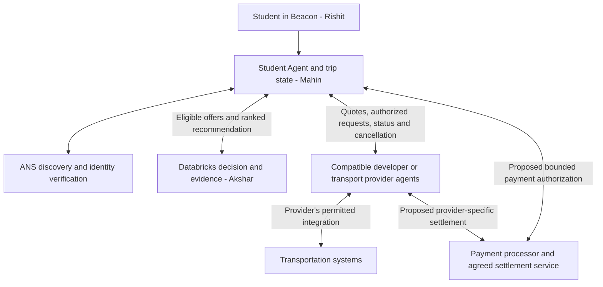

# Beacon provider-agent pivot: what changes

**Team:** Mahin, Rishit, Akshar · **Date:** September 19, 2026

**Status:** Product direction approved by Mahin. The contract additions below are proposals for the three owners to align on before implementation. This document does not mark them implemented.

Read next: [owner-by-owner updates and build order](../plans/2026-09-19-beacon-provider-network-pivot.md).

## The new version in plain English

Beacon is the student's **“get me home” coordinator**. The student gives Beacon a destination, budget, preferences and permission to act. Beacon finds compatible transportation agents, verifies their identities through ANS, gathers options and asks Databricks to choose a feasible plan. The student confirms; the selected provider agent handles the booking through its own authorized integration. Beacon follows the trip and handles recovery when the plan fails.

The product target is **one Beacon account and one saved payment method**, with no mandatory collection of Uber, Lyft or other platform logins during onboarding. That experience is possible only for providers whose permitted booking and payment arrangements support it. A provider that still requires its own user login must declare that requirement; Beacon cannot remove it by putting an agent in front of the API.

Other developers and transportation organizations can implement compatible agents. Uber, Lyft, Amtrak, Greyhound, subway systems and airlines illustrate possible services; **none is being claimed as an existing Beacon integration or partner**. A developer-operated connector remains that developer's agent, even if it supports a well-known transport brand.

The first demonstration stays focused on getting a student home. Supporting arbitrary train/plane journeys, multiple tickets and currencies is a later expansion.

## What changes from the previous idea

“Previous idea” describes the earlier product concept, not functionality already built.

| Area | Previous idea | Approved direction |
| --- | --- | --- |
| Onboarding | Link each student's Uber/Lyft accounts | Create a Beacon profile; platform linking is optional and provider-dependent |
| Booking responsibility | Student Agent integrates directly with each platform on the student's behalf | Student Agent delegates to a compatible provider agent; that agent owns its platform integration |
| Adding transportation | Beacon writes another platform-specific connector | A developer publishes a versioned agent contract that Beacon can understand, verify and admit |
| Payment experience | Use the payment arrangement behind the linked platform account | Target one saved Beacon payment method with an agreed payment/settlement arrangement for each participating provider |
| ANS | Verify agents alongside platform connections | Discover and verify independently operated agents before granting them access; platform authorization remains separate |
| Databricks | Rank a fixed set of demo ride/transit options | Rank compatible, eligible offers from the provider network using comparable cost and trip-burden evidence |
| Trip ownership | Student Agent requests and tracks a ride | Student Agent owns the journey objective; providers own their individual booking lifecycles |
| Failure recovery | Retry or switch a known ride integration | Reconcile the old booking/payment, collect fresh eligible offers and replan within the user's approved limits |
| Demo story | Several transportation choices inside one app | One coordinator works with interchangeable provider services through a common contract |

This is an extension of the existing backend. `ProviderAgent.requestTrip`, discovery, confirmation, verification, monitoring and replanning already establish much of the separation. We do not need to discard that work.

## How a trip works

1. **Receive the objective.** Beacon keeps the student's exact origin/destination, preferences and account information private. Initial provider requests contain coarse zones and necessary constraints.
2. **Discover and check providers.** Find ANS registrations, verify the registered operator and endpoint, and check contract version, service area, capabilities and supported authorization/payment arrangements. Registration alone does not make a service eligible.
3. **Collect offers.** Agents return availability, price terms, expiry, walking/waiting/travel estimates and pickup requirements. Simulated, scheduled and live evidence remain distinct. Missing information stays unknown.
4. **Choose and explain.** Databricks filters infeasible offers and ranks comparable plans. Rishit's interface presents one recommendation, its tradeoffs and any relevant uncertainty. Databricks does not book or authorize anything.
5. **Confirm and delegate.** Show the operator, service, approved price or spending cap, pickup requirements, cancellation terms and requested data. After confirmation, recheck identity, permissions and quote freshness. Send only the selected provider the required precise trip data and a limited booking/payment authorization.
6. **Book and follow through.** The provider executes through its permitted integration and returns a booking reference and status. Beacon persists progress, coordinates pickup and monitors arrival.
7. **Recover without starting over.** On failure, first establish what happened to the old booking and any charge. Replan from fresh offers. A price increase, changed terms or replacement outside the user's authorization requires another confirmation.

An initial coarse offer may be an estimate. If a provider needs precise locations to price accurately, that disclosure needs explicit permission to the verified provider. Obtain a final offer and confirmation, or an explicitly approved bounded price, before spending. Do not pretend a coarse estimate is a guaranteed fare.

The payment boxes describe future infrastructure. They are not existing integrations.

## Identity, permission and payment are different checks

| Check | What it answers | What it does not establish |
| --- | --- | --- |
| ANS identity | Which registered agent/operator and endpoint am I communicating with? | That it is Lyft-operated, can legally book Lyft, provides safe transport or may charge the student |
| Beacon authorization | May this verified agent perform this action for this trip with these data fields? | Platform API access or a usable payment method |
| Provider's platform access | Is this developer permitted to perform the requested operation on that transport system? | Student consent to this particular booking |
| Payment authorization | Who may charge which amount/currency for which booking, and how settlement/refunds work? | Unlimited spending, permission to reuse credentials or guaranteed booking success |

ANS complements authorization systems such as OAuth; it does not replace them. Agent identity must also be bound to the actual connection/request, rather than trusted from a copied ID or display name. [GoDaddy's ANS explanation](https://www.godaddy.com/resources/news/dont-trust-verify-offline-sub-millisecond-agent-verification-with-ans)

The provider must authenticate Beacon's request and check its limited authority too. A token is evidence of a granted permission, not the agent's “brain.” The existing Student Agent uses explicit orchestration logic; Databricks uses a deterministic decision policy with optional grounded explanation assistance. A developer agent may use rules or an LLM internally, but its external behavior must obey the same contract.

## The payment decision we must make concrete

The intended customer experience is a saved payment method in Beacon. The processor stores payment credentials; Beacon stores a reference and display metadata. Provider agents never receive raw card details or Beacon's processor secret.

A saved-method reference is not automatically spendable by arbitrary developers. Before a real paid provider is enabled, Mahin must document an accepted processor/provider arrangement, who charges the student, who pays the transport operator, and who handles refunds/disputes. The team has not selected or implemented that arrangement.

For the first demo, implement a **simulated payment authorization** with the real intended restrictions: selected provider, quote, booking attempt, amount cap, currency, expiry and single-use/retry behavior. Display “Demo payment — no charge.” Do not collect real card numbers.

For future live operation, the provider gets an opaque, narrowly scoped grant through the agreed payment system. Reusing a booking request must not cause a second booking or charge. A timeout leaves payment/booking status uncertain until reconciled; it does not establish failure or a refund.

## What stays, what is missing

Repository review baseline: `origin/main` at `64e0c04` and Rishit's UI branch at `17fa00f`. This is a code/document review, not a new deployed-system or credential test.

| Area | Reuse | Pivot work still required |
| --- | --- | --- |
| Mahin's backend | Student Agent, provider HTTP adapters, ANS directory, owner-protected trips, confirmation/location gates, booking reconciliation and monitoring | General developer service manifest, distinct service IDs, contract compatibility, richer quote/booking terms, delegated authorization and payment lifecycle |
| Akshar's track | SQL/local decision policy, source-backed evidence, cancellation exclusions, two-corridor runtime integration, privacy-preserving outcome helpers | Adapt eligible network offers; agree a new policy for expanded burdens/unknowns; connect verified outcomes; verify hosted access and activated data versions |
| Expanded data work | Full BT archive/direct-journey tooling, draft wider pedestrian coverage, lighting/waiting helpers | Wider pilot/cloud activation and shared interfaces remain gated; mapped lights do not prove illumination, published hours do not prove access |
| Rishit's UI | Mobile shell, onboarding views, trip screens, map component and demo controls | Connect real Trip API/evidence; add provider/consent/payment states; replace timer-driven progress for connected trips |
| Account/payment | Existing trip ownership protections and local UI profile preview | Durable Beacon account/profile and real saved-payment infrastructure are not established by those features |
| Independent ecosystem | Independently callable simulated provider services | Developer onboarding/conformance and actual independent operators; one Beacon operator serving several services is not several independent companies |

There is one concrete integration issue at the inspected main commit: its quote normalizer turns an omitted transfer count into zero, while Akshar's new ranked result supports unknown counts. Verify that the omission-preserving fix from [PR #17](https://github.com/aksharkakkad-web/VTHacks/pull/17) reaches the integrated branch and test the entire handoff. Do not make an unknown trip look easier.

Implementation evidence: [data/API handoff](../../DATABRICKS_APP_HANDOFF.md), [expanded-pilot limits](../../DATABRICKS_EXPANDED_PILOT_STATUS.md), [provider-outcome contract](../../DATABRICKS_PROVIDER_OUTCOMES.md), [current provider interface](../../../src/agents/contract.ts), [Student Agent](../../../src/agents/student/service.ts). Earlier live Databricks checks are recorded in [PR #18](https://github.com/aksharkakkad-web/VTHacks/pull/18); they do not prove current credentials or this new pivot work.

## Shared changes to agree before building

These are proposed additions, not a replacement for the checked-in `src/types/**` yet.

| Contract | Required agreement |
| --- | --- |
| Provider manifest | Protocol/profile version, registered operator, unique service ID, endpoint, service area, supported operations, authorization/payment requirements and live/simulated status |
| Offer | Stable quote ID, service ID, expiry, price currency/units/fees and firm-versus-estimate status, pickup details, burden evidence, cancellation terms and required permissions |
| Decision input/output | One-to-one offer/plan mapping; eligibility before ranking; supported currencies/modes; unknown-data treatment; selected quote and policy/evidence versions |
| Consent and booking | Bind consent to offer/version, provider, permitted fields, price/terms and retry-safe booking attempt; specify when reconfirmation is required |
| Payment/status | Private grant reference; authorization/charge/refund/unknown states separate from trip status; provider request reconciliation and cancellation results |
| UI response | Safe display fields, operator identity, simulation/source labels, required action, quote expiry, pickup instructions and actual booking/payment state; no private grants |

Keep the existing modes and USD demo assumptions for the first slice. Version any expansion. Rail/air itineraries need their own passenger, ticketing, deadline, cancellation and transfer semantics; adding a string to a mode list is not support for those journeys.

## Demo and pitch boundaries

- **Show:** a confirmed objective, verified compatible provider, Databricks choice, delegated simulated booking, progress and recovery from a cancellation. A second compatible service should be addable without platform-specific logic in the Student Agent.
- **Keep:** user confirmation, precise-location authorization, unknown evidence, actual source/engine labels, Telegram consent and the existing frozen demo prices.
- **Describe safety concretely:** reduce avoidable walking, waiting, difficult handoffs and failed-plan improvisation. Do not claim to predict crime or certify the safest route. No stranger matching or assumptions of sobriety.
- **Defer:** real commercial bookings/charges, unrestricted multi-leg travel and unsupported geographic coverage until their integrations and permissions are demonstrated.

The architecture still uses APIs. Its value is a common contract between independently operated services, explicit trust and permissions, and a coordinator that owns the continuing objective across failures. An agent label alone does not create that value.

External feasibility checked September 19, 2026: Uber's documented request scope requires user authorization and production approval; an agent cannot bypass those requirements. Lyft describes a Concierge API without rider login, with payment handled by the booking organization. Neither establishes Beacon's access, a partnership or permission to resell rides. [Uber scopes](https://developer.uber.com/docs/riders/guides/scopes), [Lyft Concierge API](https://help.lyft.com/business/hc/en-us/articles/360001599667-Concierge-API-overview), [Lyft payment responsibility](https://help.lyft.com/business/hc/en-us/articles/1255550306-Concierge-Rider-FAQs)
